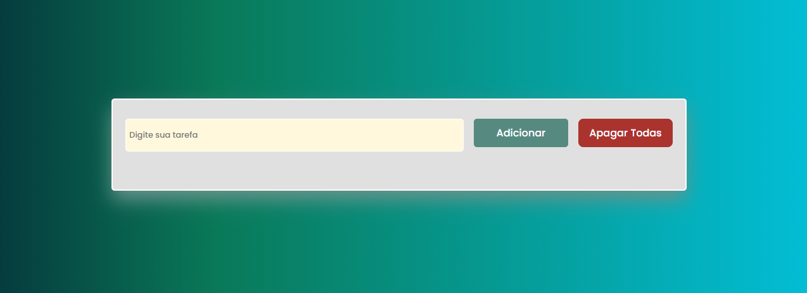
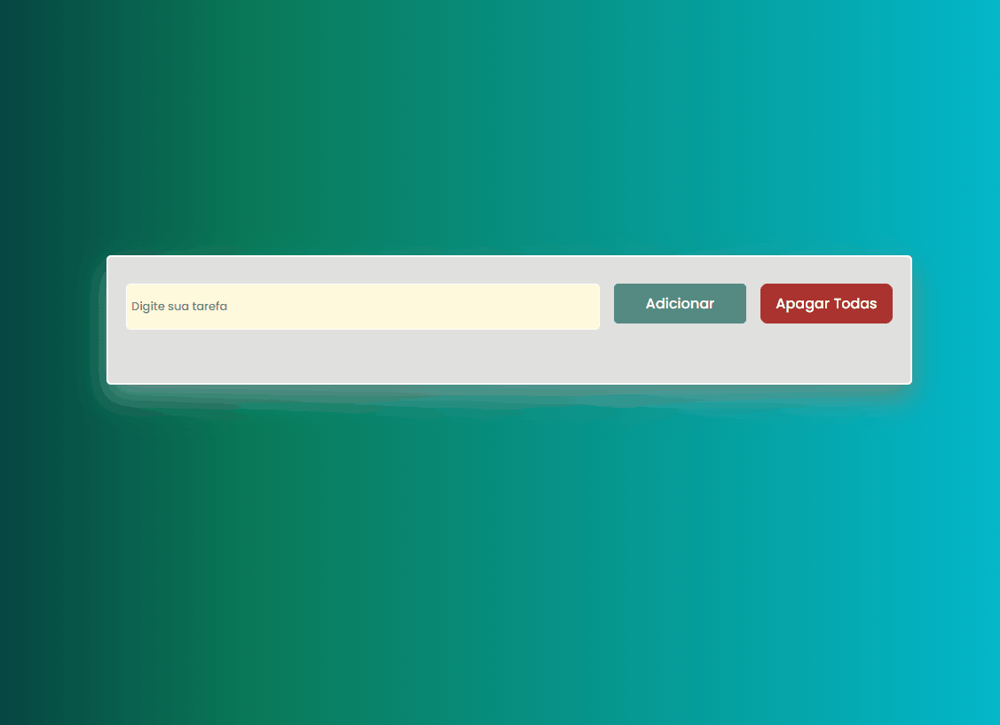

<h1 align="center">
    Projeto ToDo 
</h1 align="center">

        Projeto básico utilizando html,css e javascript, onde o objetivo é adicionar uma tarefa, armazenar ela no localstorage e depois apagá-la  

          Projeto hospedado no netlify: https://todoversion1.netlify.app/

Imagens do projeto:

    
    
 

## 💻 Tecnologias
 Este Projeto foi feito utilizando as seguintes tecnologias:

 - ✔️ HTML5
 - ✔️ CSS3
 - ✔️ JavaScript

 